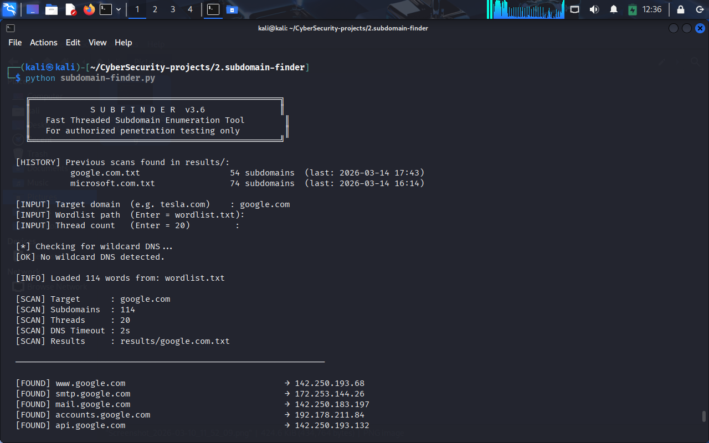
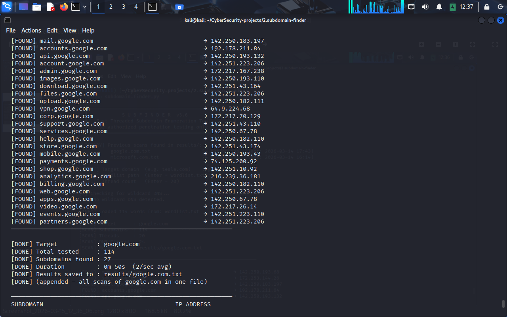
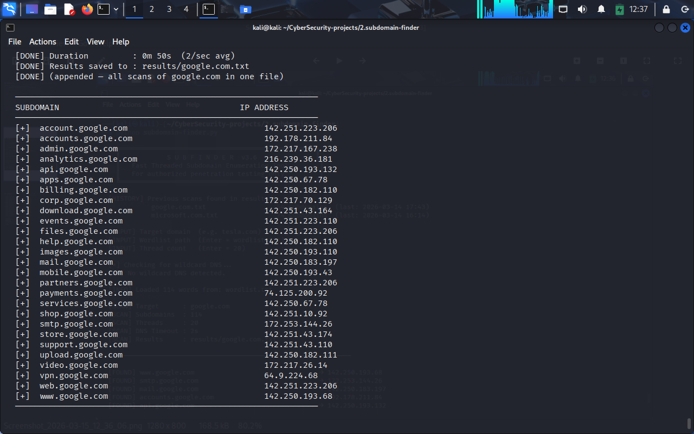

# SubFinder

Fast, threaded Python tool for **DNS-based subdomain enumeration**.

SubFinder is a lightweight reconnaissance tool designed to discover subdomains of a target domain using a wordlist and DNS resolution. The project was built as part of a cybersecurity learning journey to understand how reconnaissance tools used in penetration testing actually work internally.

⚠️ **For authorized security testing and educational purposes only.**

---

# Table of Contents

* Overview
* Features
* Reconnaissance Workflow
* Installation
* Usage
* Example Output
* Demo
* Project Structure
* How the Tool Works
* Learning Objectives
* Future Improvements
* Author
* License
* Disclaimer

---

# Overview

During the reconnaissance phase of penetration testing, one of the first tasks is identifying the **attack surface of a target domain**. Many organizations host multiple services under different subdomains such as:

```
api.example.com
admin.example.com
portal.example.com
cdn.example.com
```

Discovering these subdomains helps security researchers identify potential entry points into an organization's infrastructure.

SubFinder automates this process by:

1. Loading a list of possible subdomain names
2. Combining each name with the target domain
3. Sending DNS queries
4. Recording valid subdomains that resolve to an IP address

---

# Features

* Multithreaded subdomain scanning
* DNS resolution using Python's built-in socket library
* Wildcard DNS detection
* Scan progress indicator
* Automatic results storage
* Scan history tracking
* Clean command-line interface
* Lightweight and dependency-free
* Designed for learning penetration testing workflows

---

# Reconnaissance Workflow

SubFinder is part of a broader penetration testing reconnaissance pipeline.

Typical workflow used by security researchers:

```
Target Domain
      ↓
Subdomain Enumeration
      ↓
HTTP Probing
      ↓
Port Scanning
      ↓
Directory / Endpoint Discovery
      ↓
Vulnerability Analysis
```

SubFinder performs the **subdomain enumeration stage** of this process.

Example:

```
tesla.com
   ↓
SubFinder
   ↓
api.tesla.com
auth.tesla.com
shop.tesla.com
cdn.tesla.com
```

These discovered domains can then be tested for web services, open ports, or vulnerabilities.

---

# Installation

Clone the repository:

```bash
git clone https://github.com/omprakash-elph/subdomain-finder.git
cd subdomain-finder
```

SubFinder uses only Python's standard library, so **no additional dependencies are required**.

Ensure Python 3 is installed:

```bash
python3 --version
```

---

# Usage

Run the tool using Python:

```bash
python3 subdomain-finder.py
```

You will be prompted for:

```
[INPUT] Target domain
[INPUT] Wordlist path
[INPUT] Thread count
```

Example:

```
Target domain: microsoft.com
Wordlist path: wordlist.txt
Thread count: 20
```

---

# Example Output

```
[FOUND] api.microsoft.com        → 20.76.201.171
[FOUND] login.microsoft.com      → 20.190.146.33
[FOUND] portal.microsoft.com     → 150.171.73.13
[FOUND] support.microsoft.com    → 13.107.246.58
[FOUND] cdn.microsoft.com        → 23.223.15.173
```

The discovered subdomains are automatically saved to the **results/** directory.

Example results file:

```
results/microsoft.com.txt
```

---

# Demo

### Scan Example 1



### Scan Example 2



### Scan Example 3



---

# Project Structure

```
subdomain-finder
│
├── subdomain-finder.py
├── wordlist.txt
├── screenshots/
│   ├── Screenshot_1.png
│   ├── Screenshot_2.png
│   └── Screenshot_3.png
│
├── results/
│
├── README.md
├── LICENSE
└── .gitignore
```

---

# How the Tool Works

The tool follows these steps internally:

### 1. Load Wordlist

The program loads a list of potential subdomain names.

Example:

```
www
mail
api
admin
dev
test
```

### 2. Generate Candidate Subdomains

Each entry is combined with the target domain.

Example:

```
api.microsoft.com
admin.microsoft.com
dev.microsoft.com
```

### 3. DNS Resolution

Python's socket library sends DNS queries to check whether the domain resolves.

Example:

```
socket.gethostbyname("api.microsoft.com")
```

If the DNS lookup succeeds, the subdomain exists.

### 4. Multithreading

Multiple worker threads process subdomains simultaneously to speed up scanning.

### 5. Result Storage

Valid subdomains are saved to a results file for later analysis.

---

# Learning Objectives

This project was built to understand key concepts in cybersecurity and software development:

* DNS infrastructure
* Subdomain enumeration techniques
* Python networking
* Multithreading in Python
* Reconnaissance methodology
* Building custom penetration testing tools

Instead of relying only on existing tools, the goal is to **learn how security tools work internally**.

---

# Future Improvements

Planned enhancements for future versions:

* Async DNS resolution for faster scanning
* Integration with SecLists wordlists
* HTTP probing for discovered hosts
* JSON/CSV export formats
* Passive subdomain discovery using certificate transparency logs
* Integration into a larger recon automation framework

---

# Author

Om Prakash

Cybersecurity learner focused on:

* Ethical hacking
* Penetration testing
* Building custom security tools in Python
* Learning reconnaissance methodologies

GitHub:

https://github.com/omprakash-elph

---

# License

MIT License

---

# Disclaimer

This tool is intended **strictly for educational purposes and authorized security testing**.

Do not use this tool against systems or networks without **explicit permission from the owner**.

Unauthorized scanning or testing may violate laws and regulations.
